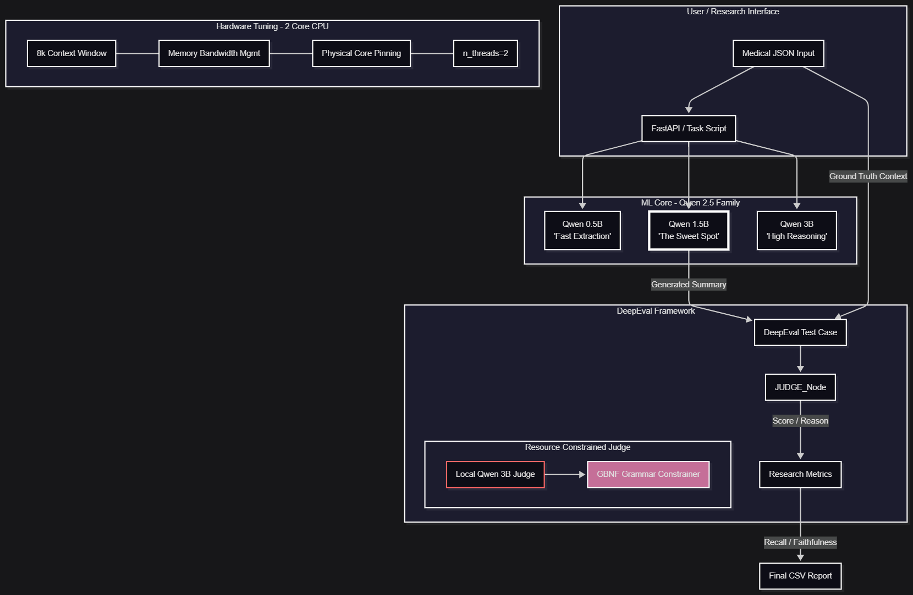

# Pipeline Architecture

Overview of how a medical document moves through the system — stage by stage.

For deployment-specific details, see the dedicated guides:

- **[Production architecture](./PROD_ARCHITECTURE.md)** — cloud pipeline with Groq
- **[Local LLM architecture](./LOCAL_ARCHITECTURE.md)** — offline models and Redis worker



---

## The big picture

```text
PDF  →  Read text  →  Split into chunks  →  Extract diseases & labs  →  Summarize  →  Results
```

The system does not ask the LLM to read the entire document and guess. It extracts structured facts first, then summarizes only those facts. That is the main strategy for keeping outputs reliable.

---

## Pipeline stages

### 1. Document ingestion

- Accepts PDF uploads (scanned or digital)
- **Local:** PyMuPDF first, Docling with OCR as fallback
- **Production:** PyMuPDF only (faster, lighter)
- Output: plain text, optionally converted to markdown

### 2. Chunking

- Splits the document into sections using markdown headers
- Falls back to fixed-size chunks if no headers are found
- **Local** also supports semantic chunking with embedding similarity (slower but more context-aware)

### 3. Disease extraction

- **Local:** Fine-tuned PubMedBERT finds disease names; medSpaCy filters out negated findings ("no evidence of pneumonia" → pneumonia is skipped)
- **Production:** Groq LLM extracts diseases from text via a structured JSON prompt

### 4. Lab extraction

- **Local:** medSpaCy TargetRules match common lab test patterns (name, value, unit, reference range)
- **Production:** Groq LLM extracts labs in the same JSON pass as diseases

### 5. ICD-10 mapping

- **Local:** Offline CSV knowledge base (~70K codes) with fuzzy matching
- **Production:** ICD-10 codes come from the Groq extraction prompt when the model provides them

### 6. Summarization

- **Local:** Qwen 2.5 (1.5B) via llama.cpp — fast CPU inference
- **Production:** Groq API (default: `llama-3.3-70b-versatile`)
- Input is always structured JSON (diseases + labs), never the raw document
- Output is plain text — no markdown

---

## Why not feed the full document to the LLM?

Three reasons:

1. **Less noise** — clinical PDFs contain headers, tables, and boilerplate that distract small models
2. **Lower latency** — shorter input means faster inference
3. **Fewer hallucinations** — the model works from verified extractions, not free-form reading

Trade-off: some context is lost during filtering. That is an intentional reliability vs. completeness balance.

---

## Reliability mechanisms

| Mechanism | What it does |
|-----------|--------------|
| Structured extraction before generation | Facts are found by NLP tools, not invented by the LLM |
| Negation filtering | "No diabetes" does not become an active diagnosis |
| JSON schemas | Outputs have a predictable shape the frontend can render |
| Plain-text summaries | No markdown parsing issues in the UI |
| Model warming | Heavy models load once at startup, not per request |

---

## Design principles

- **Deterministic before generative** — use rules and trained models where possible; use the LLM only for summarization (local) or as a lightweight all-in-one extractor (production)
- **Separate extraction from generation** — each stage has one job
- **Async processing** — uploads return immediately; results stream via SSE
- **CPU-friendly** — no GPU required, though it helps for local model loading

---

## Related docs

- [DECISIONS.md](./DECISIONS.md) — tool choices and trade-offs
- [METRICS.md](./METRICS.md) — performance benchmarks
- [SETUP.md](./SETUP.md) — how to install and run
