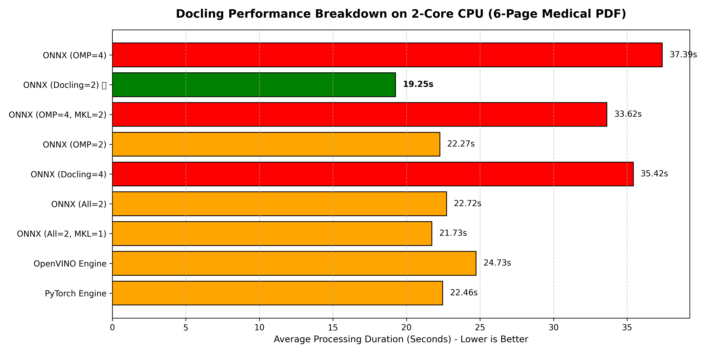

# Technical Benchmark: Medical Summarization Performance
**Date:** May 2026  
**Hardware:** 2-Core CPU / 4 Logical Processors (WSL Ubuntu)  
**Model Family:** Qwen 2.5 (0.5B, 1.5B, 3B)  
**Format:** GGUF (Q4_K_M)

### The Data Proof
By instrumenting my functions with a `@time_metrics` decorator, I captured the exact impact of the **global Initialization** refactor:

| Task | Before (Cold) | After (Global Init) | Speedup |
| :--- | :--- | :--- | :--- |
| PDF Extraction | 47.05s | 23.51s | **2.0x** |
| Chunking | 10.20s | 4.20s | **2.4x** |
| Disease NER | 14.68s | 5.81s | **2.5x** |
| **Total Cycle** | **70.74s** | **33.99s** | **2.1x** |

### Key Insight
Global variables are often discouraged in general web dev, but in **AI Engineering**, they are a critical tool for "Model Warming." If you aren't initializing your models outside your request/task handlers, you're burning money and latency.

## 1. Text Extraction Docling performance

{width=500px height=300px}
Explanation 
### Performance Benchmarks (2-Core CPU Laptop)

The following metrics reflect processing speeds for an identical **6-page complex medical report** using different pipeline configurations and backend runtimes. 

| Backend Engine | Configuration Details | Thread Count | Avg. Execution Time | Status / Efficiency |
| :--- | :--- | :--- | :--- | :--- |
| **ONNX Runtime** | `Docling Native Configuration` | **2 Threads** | **19.25s** |  **Optimal (1:1 Core Match)** |
| **ONNX Runtime** | `All Envs Forced (MKL=1)` | **2 Threads** | **21.73s** |  Highly Efficient |
| **PyTorch** | `Default Engine Match` | Dynamic | **22.46s** |  Fast but variable memory overhead |
| **ONNX Runtime** | `OMP_NUM_THREADS = 2` | **2 Threads** | **22.27s** |  Stable CPU execution |
| **ONNX Runtime** | `All Envs Forced (Mixed)` | **2 Threads** | **22.72s** |  Moderate efficiency |
| **OpenVINO** | `Default Engine Match` | Dynamic | **24.73s** |  Stable baseline |
| **ONNX Runtime** | `OMP_NUM_THREADS = 4, MKL = 2`| **4 Threads** | **33.62s** |  Severe oversubscription |
| **ONNX Runtime** | `Docling Native Configuration` | **4 Threads** | **35.42s** |  Severe thread thrashing |
| **ONNX Runtime** | `OMP_NUM_THREADS = 4 (No Def)`| **4 Threads** | **37.39s** |  Worst Case Scenario |

### Concurrency Benchmarks (Processing 2 Documents Simultaneously)
The following metrics contrast the hardware effects of letting concurrent files fight for resources versus locking them into a predictable sequential pipeline.

| Concurrency Architecture | Strategy Details | Active Core Usage | Execution Time per File | Total Pipeline Duration | Hardware / User Impact |
|---|---|---|---|---|---|
| No Locks (Current Setup) | Files run in parallel; both demand OMP=2 |  4 Threads on 2 Cores | ~35s – 39s | ~39.00s |  Severe Thread Thrashing. Laptop suffers high thermal spikes; both users wait maximum time. |
| Strategy A: Sequential Queue | Forced inline using threading.Lock() |  2 Threads on 2 Cores | ~19.25s (each) | ~38.50s |  Optimal Optimization. User 1 gets instant 19s delivery; User 2 waits smoothly in line. Laptop stays cool. |
| Strategy B: Single-Core Throttling | Set OMP=1 / 1 thread per file natively |  1 Thread per Core | ~26s – 28s | ~28.00s |  True Parallel Execution. Drops individual file speed by ~35%, but yields the lowest total group completion time. |

## 2. LLM Performance
### Qwen2.5 Comparisons when summarizing single chunk(594 tokens) under same environment(2 core 16gb RAM no GPU)
**With ollama-cpp**

| **Number of Params** | **Summarization Time** |
| :--- | :--- |
| 3B parameters | 56.5255s |
| 1.5B parameters | 33.3977s |
| 0.5B parameters | 11.8657s |

**Without ollama-cpp**

| **Number of Params** |  **Summarization Time** |
| :--- | :--- |
| 3B parameters | 110.7667s |
| 1.5B parameters | 63.2841s |
| 0.5B parameters | 34.6701s |

## 3. Throughput Metrics (Tokens per Second)
Measured across varying thread counts to identify the "Memory Wall."

| Model | 2 Threads (TPS) | 4 Threads (TPS) | Scaling Factor |
| :--- | :--- | :--- | :--- |
| **Qwen 0.5B** | 18.98 | 19.20 | +1.1% |
| **Qwen 1.5B** | 3.54 | 4.12 | +16.3% |
| **Qwen 3B** | 2.38 | 2.34 | -1.7% |

**Observation:** Scaling to 4 threads on 2 physical cores hit a **Memory Bandwidth Bottleneck** for the 3B model, causing thread contention and performance degradation.

## 4. Qualitative Error Analysis (0.5B Pipeline)
Despite 100% NER recall, the 0.5B summarizer exhibited "Instruction Drift":
- **Mismapping:** WBC count (11.2) was attributed to Sodium levels.
- **Hallucination:** A1c (5.8%) was interpreted as "Hypothyroidism."
- **Root Cause:** Contextual starvation and weak attention heads in sub-1B models.

## 5. Recommended Production Architecture
For Production environments:
- **Judge Model:** Qwen 3B (Validation only).
- **Inference Model:** Qwen 1.5B (Optimal balance of 4 TPS and factual groundedness).
- **Config:** `n_threads=2` (Pinning to physical cores) with **GBNF Grammar** to enforce JSON schema compliance.
  
### Key Insight
On strict 2-core hardware configurations, assigning **4 threads causes up to a 94% performance penalty** due to heavy hardware context-switching. Forcing the layout engine down to match the physical thread budget (`num_threads=2`) delivers the fastest text extraction velocities.
